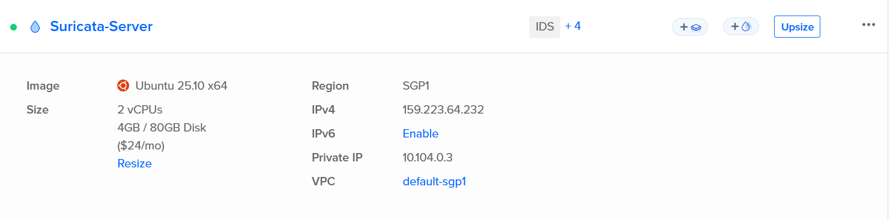
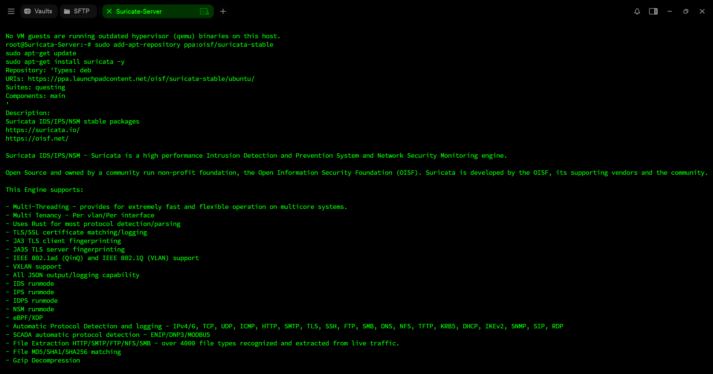
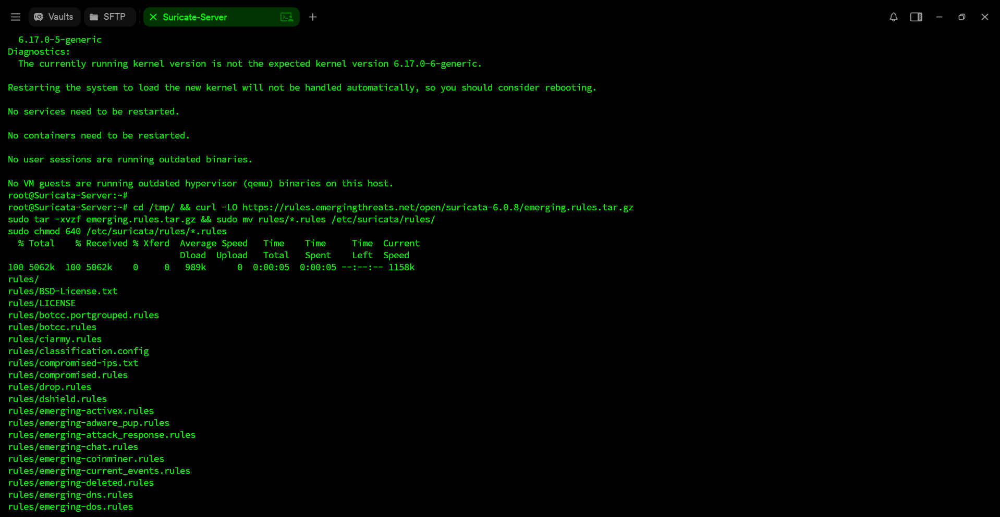
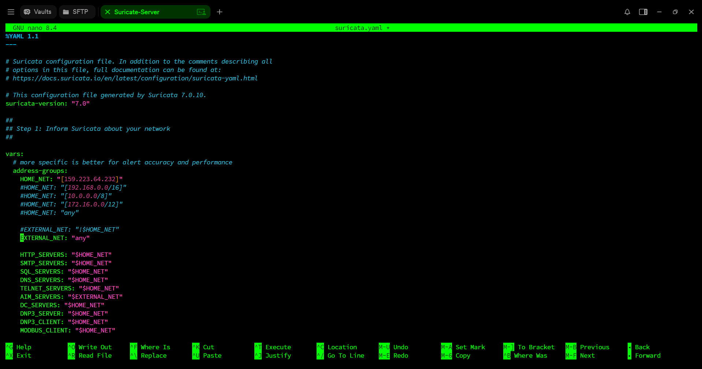
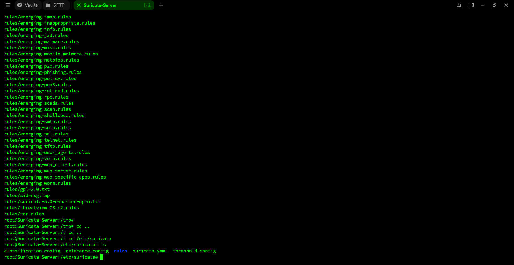
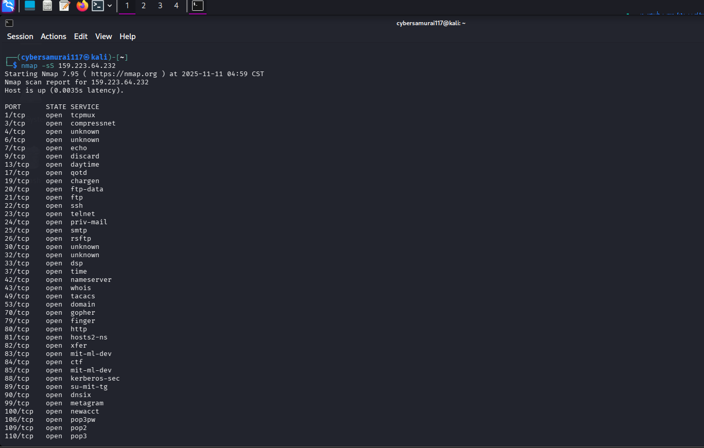
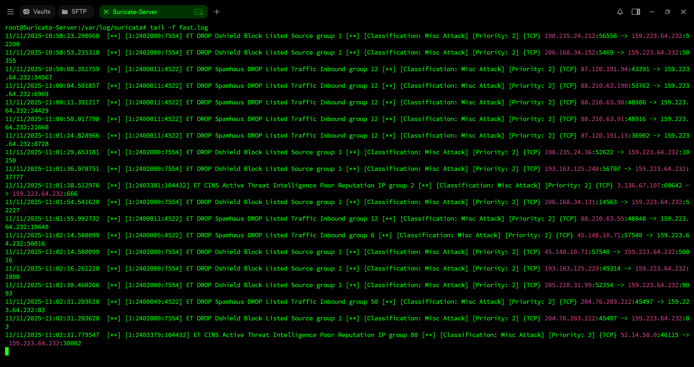
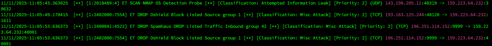

# ☁️ Cloud-Based IDS/IPS Using Suricata

## 🧠 Introduction

Intrusion Detection and Prevention Systems (IDS/IPS) are vital components of modern cybersecurity infrastructure, offering real-time monitoring and defense against malicious network activities. This project demonstrates the deployment of a **cloud-based IDS/IPS solution using Suricata** a high-performance, open-source threat detection engine.

Hosted on a **DigitalOcean Ubuntu droplet**, this setup uses Suricata’s advanced rule engine, protocol parsers, and multi-threaded inspection capabilities to analyze network traffic and detect suspicious patterns. The goal of this project is to showcase a practical implementation of Suricata in a scalable, cloud-based environment.

---

## ☁️ Cloud IDS/IPS Overview

**Suricata** is an open-source network threat detection engine capable of functioning as both an IDS (Intrusion Detection System) and an IPS (Intrusion Prevention System). It provides in-depth network analysis, rule-based detection, and protocol decoding.

### Core Capabilities of Suricata:

* **Signature-based detection** – Detects known attack patterns using rule sets (like Emerging Threats).
* **Protocol identification and parsing** – Analyzes protocols such as HTTP, TLS, DNS, SSH, SMB, FTP, etc.
* **IDS/IPS modes** – Can monitor traffic passively (IDS) or block it inline (IPS).
* **Multi-threaded performance** – Efficiently scales across multiple CPU cores.
* **File extraction and hashing** – Detects and extracts suspicious files from network streams.
* **Flow and session tracking** – Tracks stateful sessions across network protocols.
* **EVE JSON logging** – Provides structured logs for integration with SIEM platforms.
* **TLS/SSL inspection** – Identifies certificates and encryption anomalies.

By deploying Suricata in the cloud, the system gains **scalability, accessibility, and real-world simulation** of enterprise-level IDS/IPS operations.

---

## 🔍 Key Components

| Component                         | Description                                                                  |
| --------------------------------- | ---------------------------------------------------------------------------- |
| **Suricata Engine**               | Performs real-time network analysis and signature-based threat detection     |
| **Emerging Threats Ruleset**      | Provides a comprehensive collection of community-driven detection signatures |
| **Ubuntu Droplet (DigitalOcean)** | Cloud server hosting the Suricata service                                    |
| **Suricata YAML Configuration**   | Defines network variables, log paths, and capture interfaces                 |
| **Fast.log / Eve.json**           | Suricata’s output files for alerts and event data                            |

---

## 🧰 Project Implementation Phases

1. **Deployed a DigitalOcean Droplet** (Ubuntu 25.10, 2 vCPUs, 4 GB RAM)
2. **Installed Suricata** via OISF PPA repository
3. **Configured Emerging Threats Rules** and permissions
4. **Adjusted suricata.yaml** for HOME_NET and EXTERNAL_NET variables
5. **Enabled and started Suricata service** via systemd
6. **Monitored logs** and verified operational status

---

## 🖥️ 1. DigitalOcean Droplet Specifications

**Explanation:** This image displays the deployed droplet on DigitalOcean, showing the allocated CPU, memory, and region. The droplet serves as the cloud-based host for the Suricata IDS/IPS engine.

---

## ⚙️ 2. Suricata Installation Process

**Explanation:** Suricata was installed from the OISF stable PPA repository on Ubuntu. This ensures the latest stable release and consistent package updates.

---

## 📦 3. Rule Configuration

**Explanation:** Emerging Threats (ET) rules were downloaded and configured in `/etc/suricata/rules`. These rules define detection logic for known threats and suspicious traffic behaviors.

---

## 🧾 4. Suricata YAML Configuration

**Explanation:** The `suricata.yaml` file defines network variables, including HOME_NET and EXTERNAL_NET. This configuration allows Suricata to correctly classify inbound and outbound traffic.

---

## 🧠 5. Suricata Active Rules

**Explanation:** After starting the service, Suricata confirms the active rule set and begins monitoring the network interface for threats and anomalies.

---

## 🔍 6. Reconnaissance from Attack Machine

**Explanation:** This screenshot displays the results of an Nmap SYN scan (nmap -sS 159.223.64.232) executed from the Kali Linux Attack machine. The scan enumerates open ports and running services on the Suricata cloud server.This simulates a typical reconnaissance phase performed by attackers before exploiting vulnerabilities. Suricata later detects and logs these activities as potential intrusion attempts.

---

## 🚨 7. Detected Threats and Alerts

**Explanation:** This image shows Suricata successfully detecting and logging malicious network activities in real time.
The alerts include:

 1) ET SCAN Nmap OS Detection Probe — Detected during active reconnaissance.
 2) ET DROP Spamhaus DROP Listed Traffic — Indicates connections from known malicious IPs.
 3) ET DROP DShield Block Listed Source — Shows inbound packets from blacklisted sources.

Each log entry contains timestamps, classification (e.g., Misc Attack), priority level, and source/destination IPs — confirming that the IDS is functioning as expected.

---

## 🏢 Practical Deployment Use Cases

Suricata can be deployed flexibly across different parts of an organization’s network depending on monitoring or protection needs.  
This project demonstrates a scalable setup that can be adapted for both **cloud** and **on-premises** environments.

### 🔹 1. Main / Production Servers (Host-based IDS)
Suricata can be installed directly on **application or web servers** to monitor inbound and outbound traffic.  
In this **IDS mode**, it inspects packets in real time, detects malicious signatures, and logs potential intrusion attempts —  
without interrupting normal operations.

### 🔹 2. Dedicated Security Server (Network IDS/IPS)
A best-practice deployment involves hosting Suricata on a **separate monitoring node** connected to a network tap or mirrored port.  
This allows it to **analyze traffic across multiple systems** and even **block malicious packets** when configured in **IPS mode (inline)**  
using NFQueue or AF_PACKET for active prevention.

### 🔹 3. Storage or Data Servers (File Integrity & Access Monitoring)
Suricata can monitor network traffic to and from **file storage or backup servers**, detecting unusual access behavior,  
large data transfers, or ransomware-related exfiltration attempts — helping safeguard sensitive information assets.

---

### ⚙️ Summary
> This Suricata-based IDS/IPS project can be deployed on **main servers**, **storage nodes**, or a **dedicated security server**  
> to deliver real-time network visibility, intrusion detection, and active threat prevention capabilities.

---

## 🧠 Skills Gained

| Category                    | Skills Developed                                             |
| --------------------------- | ------------------------------------------------------------ |
| **Cloud Security**          | Deployment and configuration of IDS/IPS systems in the cloud |
| **Network Monitoring**      | Real-time packet inspection and protocol analysis            |
| **Threat Detection**        | Use of Suricata and Emerging Threats rule sets               |
| **System Administration**   | Service management, logging, and configuration hardening     |
| **Technical Documentation** | Structured write-up and evidence-based explanation           |

---

## 🏁 Conclusion

This project illustrates how **open-source network detection tools like Suricata** can effectively enhance cloud-based security visibility. Hosting the IDS/IPS on DigitalOcean mirrors enterprise-grade detection environments, providing insights into threat behavior and traffic analysis.

---

## 👨‍💻 Built By

**Umar Ahamed**
Cybersecurity Student • Sri Lanka
Passionate about **network defense, cloud security**, and **ethical hacking.**

⭐ Connect via GitHub: [User-Umar-Ahamed](https://github.com/User-Umar-Ahamed)
